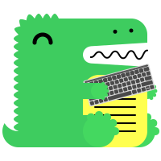

## Overview

This documentation is built using [Docusaurus](https://docusaurus.io/docs/). Docusaurus is a static site generator that is used to create documentation websites. It is a modern and flexible tool that allows for easy creation and maintenance of documentation websites.



### [Create a new documentation page](https://docusaurus.io/docs/create-doc)


1) Create a new Markdown file (`.md`) in the appropriate directory under `docs/`:

```bash
docs/
├── Getting Started/
│   └── your-new-file.md
├── Frontend/
├── Backend/
└── your-new-folder/
    └── your-new-file.md
```

2) Add the following `frontmatter` at the top of your Markdown file:

```markdown
---
title: Your New Page Title 
sidebar_label: Your New Page Label
---

Your content here...
```

3) Update the `sidebars.ts` file to include your new page. For example, to add a new page to the "Frontend" category:

```typescript
{
  type: 'category',
  label: 'Frontend',
  items: [
    'Frontend/introduction',
    'Frontend/your-new-file'  // Add your new file here
  ],
},
```

### [Images](https://docusaurus.io/docs/markdown-features#images)

1) To add an image, you have to put it in the img folder of the directory where the markdown file is located.

```bash
# Example for the root docs folder
docs/
└── img/
    └── your-new-image.png // If the markdown file is located in the root docs folder.

# Example for a specific folder
docs/
└── Frontend/
    └── img/
        └── your-new-image.png // If the markdown file is located in a specific folder.
```

2) Reference the image in your Markdown file using the following syntax:

```markdown

```

### [Navbar new category](https://docusaurus.io/docs/docs-multi-instance#docs-navbar-items)


1) Add the following to the `docusaurus.config.ts` file in the `themeConfig` section. Make sure to add the new category to the `items` array:

```typescript
{
  type: 'dropdown',
  label: 'Docs',
  position: 'left',

  items: [
    {
      label: 'Introduction',
      to: '/docs/introduction',
    },
    ...,
    {
      label: 'New Item', // Add the new item here
      to: '/docs/new-item',
    },
  ],
},
```

### [Sidebar new category](https://docusaurus.io/docs/sidebar/items)

1) Create a new file in the `docs` folder and include the following content. Ensure that you add the new category to the `items` array:

```markdown
---
id: your-new-file
title: Your New File Title
---

Your content here...
```	

2) Update the `sidebars.ts` file in the `gettingStartedSidebar` section by adding the new category to the `items` array:

```typescript
{
  type: 'category',
  label: 'Frontend',
  items: [
    'Frontend/introduction',
    'Frontend/your-new-file'  // Include your new file here
  ],
},
```

