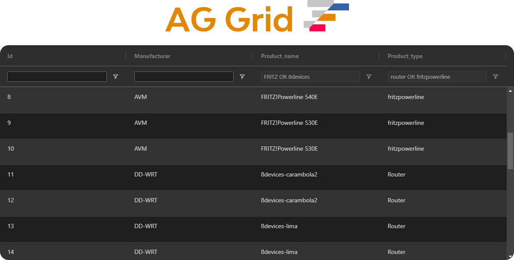

# AG-Grid

## Overview

[AG-Grid](https://www.ag-grid.com/javascript-data-grid/getting-started/) is a powerful JavaScript data grid library that offers extensive features for handling large datasets, real-time updates, and complex table interactions. In this project, AG-Grid has replaced static custom tables due to the increasing scale of firmware images and analysis tasks, which demand advanced functionality and high performance.

## Why AG-Grid?

Initially, static custom tables were used for rendering and managing data. However, as the system expanded to process a large number of firmware images and handle in-depth analysis, these tables lacked the necessary functionality to efficiently manage large datasets. The key reasons for transitioning to AG-Grid include:

- **Performance & Scalability**: AG-Grid is optimized for handling large datasets with virtual scrolling, pagination, and lazy loading capabilities.
- **Dynamic Data Handling**: Supports real-time data updates and refreshes efficiently without performance degradation.
- **Rich Features**: Provides built-in sorting, filtering, grouping, and customizable columns.
- **Advanced Customization**: Allows custom cell renderers, action buttons, and inline editing.
- **Auto-Resizing and Adaptive Layout**: Columns and rows adjust dynamically based on content and container size.

### Grid Customization
- **Dynamic Columns**: The table columns are dynamically created based on `columnTitles`.
- **Conditional Columns**: If `showActions` is enabled, an additional column for actions is included.
- **Resizable & Adaptive Layout**: AG-Grid dynamically adjusts to container size and allows auto-resizing.

### Key Features Implemented
| Feature                  | Description |
|--------------------------|-------------|
| **Sorting & Filtering**  | Supports multi-column sorting and advanced filtering options. |
| **Dynamic Column Resizing** | Adjusts columns based on content and screen size. |
| **Row Selection** | Allows row selection for user interactions. |
| **Action Buttons** | Custom button renderer for interactive operations. |
| **Real-Time Updates** | Integrates with backend services to update data dynamically. |

