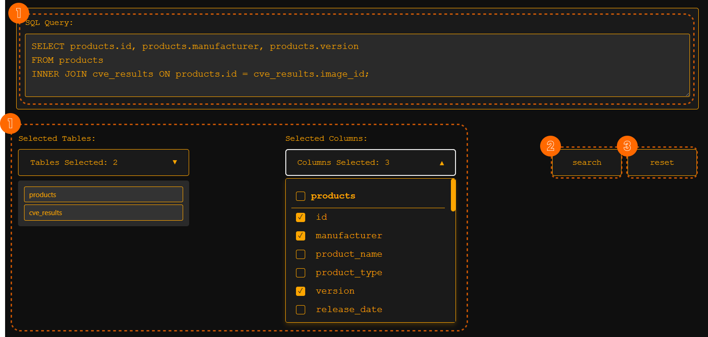

# Data Explorer

### Overview
The Data Explorer component provides an interactive SQL query builder, allowing users to construct and execute queries dynamically. It provides a structured way to select tables, columns, and preview SQL queries before executing them. The component is integrated with backend services to fetch and display query results.

### Key Features
- Table and column selection for SQL queries.
- Dynamic SQL query generation.
- Data retrieval and visualization.
- Integration with backend services for SQL execution.

### Components
| Component | Description |
|-----------|-------------|
| **SQL Query Builder** | Enables users to build and modify SQL queries. |
| **Dropdown Selectors** | Allows selection of tables and columns for querying. |
| **Table Display** | Renders query results in a structured format. |

## Details

### **UI**
- A **SQL query editor** (`textarea`) where users can manually enter SQL queries.
- **Table and column selection dropdowns** for constructing SQL queries dynamically.
- A **search button** to execute queries and display results in a table.
- A **reset button** to clear selections and queries.
- A **result table** to display query results using `<app-table>`.

### **Methods**
- `search()`: Executes the constructed SQL query and fetches results.
- `reset()`: Clears selected tables, columns, and the query.
- `getSelectedColumnsCount()`: Returns the count of selected columns.
- `toggleTableSelection(table: string, event: MouseEvent)`: Handles user selection of tables.
- `toggleColumnSelection(table: string, column: string, event: MouseEvent)`: Handles column selection.
- `updateSqlQuery()`: Constructs the SQL query based on selected tables and columns.

### **Services Used**
 **Image Service**: Executes SQL queries and returns the results.
  - `testSQL(sqlQuery)`: Sends SQL query to the backend for execution.
  - `getCveResults()`: Fetches CVE results from the API.
  
[Dynamic SQL Query Builder Service](./Services/dynamicsqlquerybuilder.md): Builds SQL queries dynamically based on user selections.
  - Defines **table relationships** for automatic JOIN clause generation.
  - Generates **SELECT, FROM, WHERE, ORDER BY, and LIMIT** clauses dynamically.
  - Implements `generateQuery()`, `generateJoins()`, `validateTables()`, and `getRelationship()` methods.
  - Ensures proper SQL syntax formatting.

## Workflow

1. **User Interaction:**
   - The user selects tables and columns using dropdowns.
   - The SQL query editor dynamically updates to reflect selections.
   - The user can modify the SQL query manually.

2. **Query Execution:**
   - Clicking the `search` button sends the query to the backend (`image.service.ts`).
   - The response is displayed in `<app-table>`.

3. **Reset Functionality:**
   - Clicking `reset` clears selections and resets the query.

