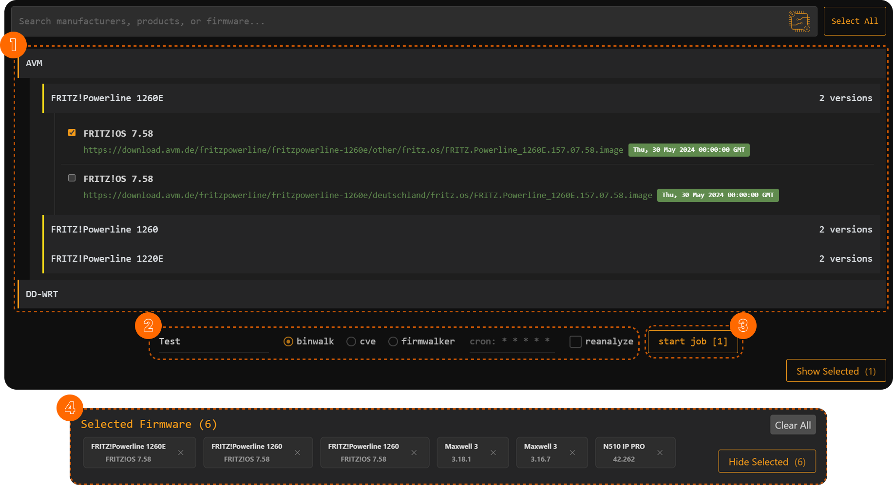

# Firmware Vault

### Overview
The Firmware Vault provides a user-friendly interface for selecting firmware, choosing analysis tools (Binwalk, CVE-Bin-Tool, and Firmwalker), scheduling jobs using cron expressions, and viewing selected firmware details.

### Key Features
- Firmware selection and management.
- Job creation with custom scheduling (Cron expressions).
- Integration with backend services to fetch and analyze firmware.

### Components
| Component | Description |
|-----------|-------------|
| **Firmware Vault** | Main component for firmware selection and job execution. |
| **Site List** | Displays firmware categorized by manufacturer and product. |

## Details

### **UI**
- **Firmware Selection List** (`<app-site-list>` component) to browse and select firmware.
- **Job Configuration Panel** to enter job name, select analysis tools, and configure cron expressions.
- **Selected Firmware Display** to show and manage chosen firmware.
- **Job Submission Button** to initiate analysis on selected firmware.
- **Collapse Button** to toggle visibility of the selected firmware section.

### **Methods**
- `createJobForSelectedFirmware()`: Validates and submits jobs for selected firmware.
- `loadFirmwareData()`: Fetches firmware data from the backend.
- `transformDataToSites(data: SQLResponse[])`: Groups firmware data by manufacturer and product.
- `toggleCollapse()`: Expands or collapses the selected firmware section.
- `onFirmwareSelect(firmware: FirmwareVersion)`: Handles firmware selection.

### **Services Used**
- **Scraper Service**: Manages firmware data retrieval from the database using SQL queries.
  - `getFirmwareData()`: Fetches firmware details, including manufacturer, product name, version, and download link.
- **Jobs Service**: Handles interaction with the backend for managing jobs. Manages job creation, retrieval, and toggling.
  - `getJobs()`: Fetches all jobs.
  - `addJob(job)`: Submits a new job to the backend.
  - `getJob(job_id)`: Retrieves details of a specific job.
  - `toggleJob(job_id)`: Enables or disables a job.

## Workflow

1. **Firmware Selection:**
   - Users browse and select firmware via `<app-site-list>`.
   - Selected firmware appears in the **Selected Firmware Section**.

2. **Job Configuration:**
   - Users enter a **job name**, select an **analysis tool**, and define a **cron expression**.
   - The system dynamically constructs an SQL query for the selected firmware.

3. **Job Execution:**
   - Clicking the **Start Job** button submits the job to the backend (`jobs.service.ts`).
   - The backend executes the query and starts the analysis.

4. **Firmware Management:**
   - Users can remove selected firmware or clear all selections.
   - The selected firmware section can be collapsed/expanded.
