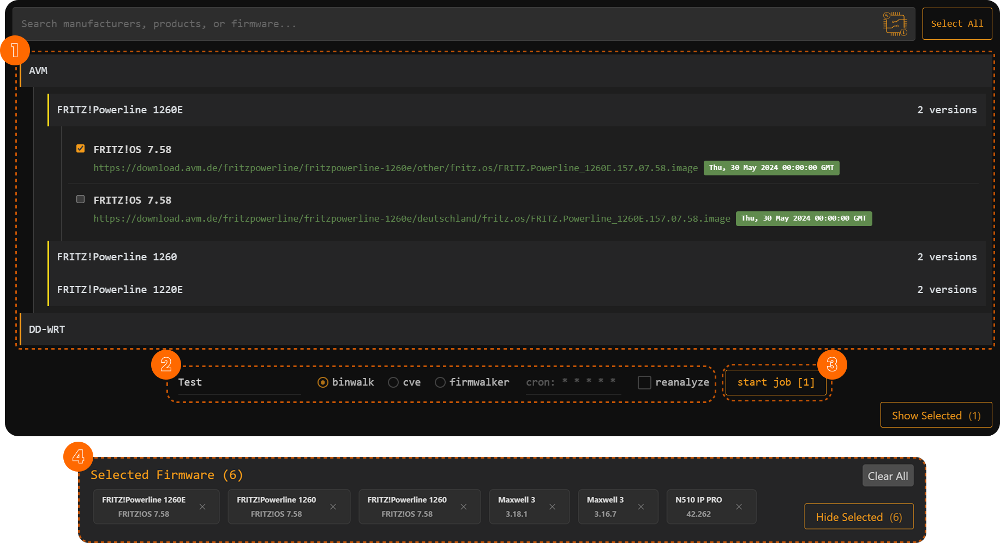
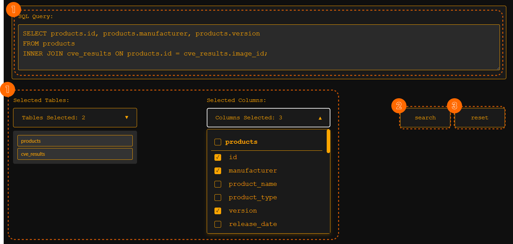

# How to use

## **Software Components & Their Functions**

[**Firmware Vault**](../Frontend/firmwarevault.md)
- Manages firmware selection and analysis.  
- Users can browse, select, and configure jobs to analyze firmware using tools like `binwalk`, `cve-bin-tool`, and `firmwalker`.  
- Executes SQL queries to filter firmware data dynamically.

[**Data Explorer**](../Frontend/dataexplorer.md)
- Provides an SQL query builder and execution interface.  
- Users can select tables and columns to dynamically generate SQL queries.  
- Runs queries on the database and displays results in a structured table.

#### **Jobs Component**
- Displays job history and allows users to filter/search for specific jobs.  
- Provides an interface to track job execution status and manage running jobs.

#### **Job Details Component**
- Displays detailed execution logs and tasks related to a specific job.  
- Allows users to toggle job status and view output logs.

## **Firmware Vault**

#### **1. Selecting Firmware**
- Browse the available firmware in the **Firmware Vault** section.
- Selected firmware will appear in the **Selected Firmware Section**.
- You can collapse/expand the selected firmware list using the "Hide Selected" button.

#### **2. Configuring a Job**
- Enter a **Job Name** in the input field.
- Choose an **Analysis Tool** from the available options:
  - `binwalk`
  - `cve-bin-tool`
  - `firmwalker`
- Define a **Cron Expression** for scheduling analysis jobs (optional).
- Enable the **Reanalyze** checkbox if needed.
- The system constructs an SQL query dynamically based on selected firmware.

#### **3. Managing Firmware**
- Remove a specific firmware by clicking the `✕` button next to it.
- Use the **Clear All** button to remove all selected firmware.

## **Data Explorer**

#### **1. Selecting Data**
- Choose tables from the **Table Dropdown**.
- Select specific columns from the **Column Dropdown**.
- The **SQL Query Editor** dynamically updates to reflect selections.
- You can manually edit the SQL query in the editor.

#### **2. Running a Query**
- Click the **Search** button to execute the query.
- The results will be displayed in a structured table.

#### **3. Reset Functionality**
- Clicking the **Reset** button clears all selected tables, columns, and queries.

## **Job Monitoring**

### **Jobs Dashboard**
- View job execution status and history in the **Jobs Component**.
- Filter jobs by name, id, command, etc.
- To see job details, click on a button (open).

### **Job Details**
- View tasks associated with a job, including execution time and results.
- Click on a job (show) to see detailed execution information.
- Expand job logs by clicking on the **Full Output** section.

