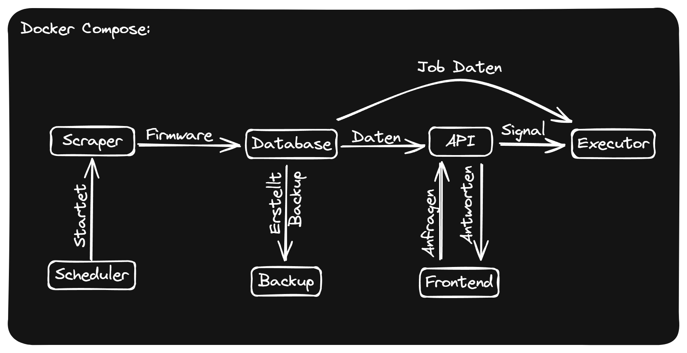

# Overview

# About Firmwarevault

In our project, we aim to build a system that automates firmware analysis as much as possible. Firmware_Vault independently collects firmware images from device manufacturers and catalogs them. With a user-friendly interface, analysis jobs can be created. Users have great flexibility in choosing analysis methods and the ability to run jobs repeatedly. This way, a wide collection of various firmware can be quickly and mostly automatically scanned for vulnerabilities.

## Scraping

* The scraping process is started by the scheduler container, which starts the Python scraper container.
* The scraper then pulls the latest firmware from the enabled vendors. Metadata is inserted in the DB, and the firmware is located in the file system. It also attempts to extract the .bin file from zip files.

## Frontend

* To simplify user interactions, a simple web UI is provided.
* It can be viewed by visiting port 80 (HTTP) of the host the system is running on.
* From here, the user can run non-editing SQL queries, view the analysis jobs and the test results, as well as create new analysis jobs.

## Analysis Engine

* This is the part that enables security testing of the firmware catalog.
* The Analysis Engine is mainly made up of three parts running in two containers.
* api_scheduler container: 

    This container hosts the API as well as the scheduler.
    
    * api.py:

        * Can be reached under port 5000.
        * Acts as the backend and works on requests from the web UI.
        * Requests can be data requests from the DB, running SQL queries, or creating a new job.
        
    * scheduler.py:

        * Can be reached under port 5001.
        * The scheduler decides if and when a job is handed to the executor.
        * Once the API has created a job, it sends a signal to the scheduler.
        * All jobs are executed once immediately. If a cron schedule was provided, the job is also entered into ap_scheduler and executed according to the schedule.
        * Before handing the job to the executor, the scheduler checks if the job is disabled.

    * executor: 
     
        * executor.py program runs in this container.
        * The analysis tools, like binwalk, etc., will also be executed in this container.
        * To use new analysis tools, they will have to be loaded onto the executor container.

        * executor.py: 

            The executor is relatively complex; please also see the dedicated documentation.

            * The executor can be reached under port 5002.
            * The executor receives only signals, so it has to pull the job data from the DB.
            * Before executing the job (an analysis that has to be performed for multiple firmware images), it has to be split into tasks (an analysis that is to be performed for a single image).
            * The execution of the tasks is done in parallel.
            * Output of the analysis tool is placed into an output.txt in the file system (volume: executor).

# Docker Compose

All components of Firmware Vault run in Docker containers. To avoid lengthy setup, the containers are combined in a Docker Compose file. 

Data that needs to be stored in a file system should be stored in a Docker volume that references a folder in the /docker_compose_dir/volumes.

If you're having trouble with Docker, take a look at the DebugDocker documentation.

# **Todos** 

If you're interested in improving Firmware Vault, take a look in the [Known TODOs](Getting%20Started/knowntodos).
